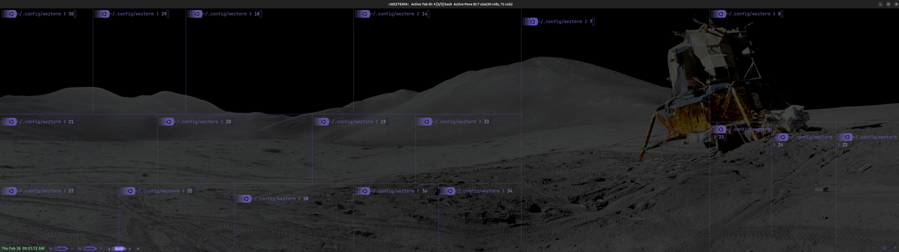
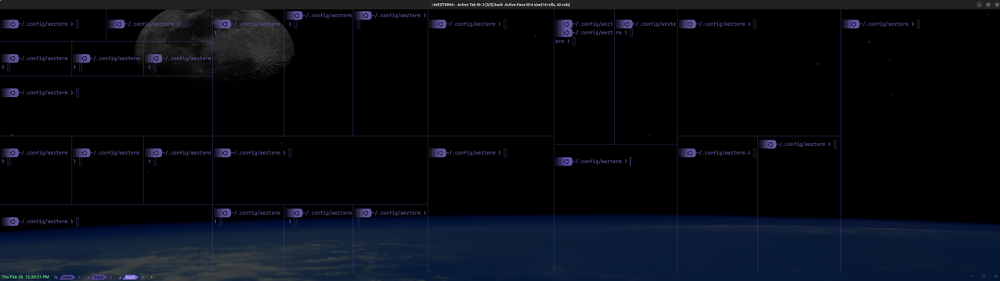

# sb_manage_panes.wezterm

This Plugin does the following:

1. Initialize a `wezterm.GLOBAL.splitpaneinfo` table:
   ```
   spi = wezterm.GLOBAL.splitpaneinfo[win_id][tab_id][pane_id] where
   spi.parent     - stores the parent pane ID - string
   spi.children   - stores a table of its children pane ID - string
   spi.directions - stores a table of its children pane SplitPane direction
   spi.vsplitedge - stores a string indicating the pane's vertical splitedge
   spi.hsplitedge - stores a string indicating the pane's horizontal splitedge
   -- Note: `win_id`, `tab_id`, `pane_id` must be a string.
   ```

2. Provide 4 event handlers to perform the following task(s):
   1. `window-config-reloaded`: Update `splitpaneinfo` everytime config reloads
   2. `sb-splitpane`: Implement `wezterm.action.SplitPane` and update `splitpaneinfo`
   3. `sb-closecurrentpane`: Implement `wezterm.action.CloseCurrentPane` and update `splitpaneinfo`
   4. `sb-equalize-panes`: Uses `wezterm.action.AdjustPaneSize` and `splitpaneinfo` to equalize the width of all panes in the active tab. In addition, it considers the presence of pane(s) with vertical slit that cannot be adjusted using WezTerm's AdjustPaneSize enum. In this plugin, such pane(s) are termed as pane(s) with _non-adjustable-left-edge (i.e. naledge)_. They can occur within a group of panes in the active tab and also in pane(s) found in their subgroup(s). Their presence causes inhomogeneity in pane equalization widths of the active tab, as is shown below:
      
      


3. Provide key bindings for WezTerm's `config.keys` to:
   | No. | Purpose | Action via |
   | :-----: | :------- | :------ |
   |1.| Active pane by index. | wezterm.action |
   |2.| Active adjacent pane on the left, right, above & below. | wezterm.action |
   |3.| Activate pane via PaneSelect. | wezterm.action |
   |4.| Adjust active pane width. | wezterm.action  |
   |5.| Create new pane on the left, right, top and bottom of currect pane. | `sb-splitpane` event handler. |
   |6.| Rotate pane sequence in a counterclockwise and clockwise manner. | wezterm.action |
   |7.| Zoom in and out of pane. | wezterm.action |
   |8.| Close active pane. | `sb-closecurrentpane` event handler|
   |9.| Equalize panes in the active tab. | `sb-equalize-panes` event handler |

4. Disable certain WezTerm default key-bindings related to pane management.

**Caveats:**
1. All event handlers are experimental.
2. The functionality of `sb-equalize-panes` event handler is known to break after a active pane is closed by the bash `exit` command. To avoid this situation, use the "close active pane" key-binding instead. If this issue does occur, know that it is only a local issue, i.e. it is tab specific and does not affect panes in other tabs. The only recourse presently is to close the affected tab and start afresh working on a new tab.
3. The functionality of `sb-equalize-panes` event handler is also known to break if the key-bindings to split pane is not used to create new panes.

## Installation & Usage

```lua
local wezterm = require("wezterm")

local config = {}

if wezterm.config_builder then
    config = wezterm.config_builder()
end

-- Add these lines (to install and use the plugin with its default options):
local repo = "https://github.com/sunbearc22/sb_manage_panes.wezterm.git"
wezterm.plugin.require(repo).apply_to_config(config, {})

return config
```

## Options

**Default options**

```lua
local repo = "https://github.com/sunbearc22/sb_manage_panes.wezterm.git"
wezterm.plugin.require(repo).apply_to_config(config,
  {
    -- Active pane by index
    activatepanebyindex_mods = "SHIFT|CTRL|ALT",    -- see key bindings
    activatepanebyindex_key0 = ")",                 -- see key bindings
    activatepanebyindex_key1 = "!",                 -- see key bindings
    activatepanebyindex_key2 = "@",                 -- see key bindings
    activatepanebyindex_key3 = "#",                 -- see key bindings
    activatepanebyindex_key4 = "$",                 -- see key bindings
    activatepanebyindex_key5 = "%",                 -- see key bindings
    activatepanebyindex_key6 = "^",                 -- see key bindings
    activatepanebyindex_key7 = "&",                 -- see key bindings
    activatepanebyindex_key8 = "*",                 -- see key bindings
    activatepanebyindex_key9 = "(",                 -- see key bindings
    -- Active adjacent pane on the left, right, above & below
    activatepanedirection_mods = "SHIFT|CTRL",      -- see key bindings
    activatepanedirection_left_key = "LeftArrow",   -- see key bindings
    activatepanedirection_right_key = "RightArrow", -- see key bindings
    activatepanedirection_up_key = "UpArrow",       -- see key bindings
    activatepanedirection_down_key = "DownArrow",   -- see key bindings
    -- Activate pane via PaneSelect
    paneselect_mods = "LEADER",                     -- see key bindings
    paneselect_key = "8",                           -- see key bindings
    paneselect_num_key = "9",                       -- see key bindings
    paneselect_swapwithactive_key = "0",            -- see key bindings
    -- Adjust active pane size
    adjustpanesize_mods = "CTRL",                   -- see key bindings
    adjustpanesize_left_key = "LeftArrow",          -- see key bindings
    adjustpanesize_right_key = "RightArrow",        -- see key bindings
    adjustpanesize_up_key = "UpArrow",              -- see key bindings
    adjustpanesize_down_key = "DownArrow",          -- see key bindings
    -- Create new pane on the left, right, top and bottom of currect pane
    splitpane_mods = "LEADER",                      -- see key bindings
    splitpane_left_key = "h",                       -- see key bindings
    splitpane_right_key = "l",                      -- see key bindings
    splitpane_up_key = "k",                         -- see key bindings
    splitpane_down_key = "j",                       -- see key bindings
    -- Rotate pane sequence in a counterclockwise and clockwise manner
    rotatepanes_mods = "LEADER",                    -- see key bindings
    rotatepanes_counterclockwise_key = "b",         -- see key bindings
    rotatepanes_clockwise_key = "n",                -- see key bindings
    -- Zoom in and out of pane
    togglepanezoomstate_mods = "LEADER",            -- see key bindings
    togglepanezoomstate_key = "z",                  -- see key bindings
    -- Close active pane
    closecurrentpane_mods = "LEADER",               -- see key bindings
    closecurrentpane_key = "c",                     -- see key bindings
    -- Equalize panes in active tab
    equalize_panes_mods = "LEADER",                 -- see key bindings
    equalize_panes_key = "e",                       -- see key bindings
  }
)
```

## Key Bindings

**Default keys**

_Rename Tab_
| Key Binding | Action |
| :----- | :------- |
| <kbd>LEADER</kbd><kbd>t</kbd>  | Rename active tab. |

_Active Pane By Index_
| Key Binding | Action |
| :----- | :------- |
| <kbd>SHIFT</kbd><kbd>ALT</kbd><kbd>CTRL</kbd><kbd>)</kbd> | Activate Pane 0. |
| <kbd>SHIFT</kbd><kbd>ALT</kbd><kbd>CTRL</kbd><kbd>!</kbd> | Activate Pane 1. |
| <kbd>SHIFT</kbd><kbd>ALT</kbd><kbd>CTRL</kbd><kbd>@</kbd> | Activate Pane 2. |
| <kbd>SHIFT</kbd><kbd>ALT</kbd><kbd>CTRL</kbd><kbd>#</kbd> | Activate Pane 3. |
| <kbd>SHIFT</kbd><kbd>ALT</kbd><kbd>CTRL</kbd><kbd>$</kbd> | Activate Pane 4. |
| <kbd>SHIFT</kbd><kbd>ALT</kbd><kbd>CTRL</kbd><kbd>%</kbd> | Activate Pane 5. |
| <kbd>SHIFT</kbd><kbd>ALT</kbd><kbd>CTRL</kbd><kbd>^</kbd> | Activate Pane 6. |
| <kbd>SHIFT</kbd><kbd>ALT</kbd><kbd>CTRL</kbd><kbd>&</kbd> | Activate Pane 7. |
| <kbd>SHIFT</kbd><kbd>ALT</kbd><kbd>CTRL</kbd><kbd>\*</kbd> | Activate Pane 8. |
| <kbd>SHIFT</kbd><kbd>ALT</kbd><kbd>CTRL</kbd><kbd>(</kbd> | Activate Pane 9. |

_Active Adjacent Pane on the Left, Right, Above & Below Of Current Pane_
| Key Binding | Action |
| :----- | :------- |
| <kbd>SHIFT</kbd><kbd>CTRL</kbd><kbd>←</kbd> | Activate Left Pane. |
| <kbd>SHIFT</kbd><kbd>CTRL</kbd><kbd>→</kbd> | Activate Right Pane. |
| <kbd>SHIFT</kbd><kbd>CTRL</kbd><kbd>↑</kbd> | Activate Above Pane. |
| <kbd>SHIFT</kbd><kbd>CTRL</kbd><kbd>↓</kbd> | Activate Below Pane. |

_Active Pane Via PaneSelect_
| Key Binding | Action |
| :----- | :------- |
| <kbd>LEADER</kbd><kbd>8</kbd> | Using Alphabet Labels "a", "s", "d", "f" and so on. |
| <kbd>LEADER</kbd><kbd>9</kbd> | Using Numeric Labels 1234567890. |
| <kbd>LEADER</kbd><kbd>0</kbd> | Swap Active & Selected Panes Location. |

_Adjust Active Pane Size_
| Key Binding | Action |
| :----- | :------- |
| <kbd>CTRL</kbd><kbd>←</kbd> | Move active pane's vertical slit to the left by 1 cell column . |
| <kbd>CTRL</kbd><kbd>→</kbd> | Move active pane's vertical slit to the right by 1 cell column. |
| <kbd>CTRL</kbd><kbd>↑</kbd> | Move active pane's horizontal slit upward by 1 cell row. |
| <kbd>CTRL</kbd><kbd>↓</kbd> | Move active pane's horizontal slit downward by 1 cell row. |

_Split Pane_
| Key Binding | Action |
| :----- | :------- |
| <kbd>LEADER</kbd><kbd>h</kbd> | Split active pane in half and spawn new pane on left-side. |
| <kbd>LEADER</kbd><kbd>l</kbd> | Split active pane in half and spawn new pane on right-side. |
| <kbd>LEADER</kbd><kbd>k</kbd> | Split active pane in half and spawn new pane above. |
| <kbd>LEADER</kbd><kbd>j</kbd> | Split active pane in half and spawn new pane below. |

_Rotate Panes Location_
| Key Binding | Action |
| :----- | :------- |
| <kbd>LEADER</kbd><kbd>b</kbd> | Rotate panes location in counterclockwise direction. |
| <kbd>LEADER</kbd><kbd>n</kbd> | Rotate panes location in clockwise direction. |

_Zoom In & Out of Pane_
| Key Binding | Action |
| :----- | :------- |
| <kbd>LEADER</kbd><kbd>z</kbd> | Zoom in and out of active pane. |

_Close Active Pane_
| Key Binding | Action |
| :----- | :------- |
| <kbd>LEADER</kbd><kbd>c</kbd> | Close/terminate the active pane. |

_Equalize Panes_
| Key Binding | Action |
| :----- | :------- |
| <kbd>LEADER</kbd><kbd>e</kbd> | Equalize the width of all panes in active tab. |

**Disabled WezTerm Default Keys**
| Key Binding | Action |
| :----- | :------- |
| <kbd>SHIFT</kbd><kbd>ALT</kbd><kbd>CTRL</kbd><kbd>←</kbd> | Split pane - left. |
| <kbd>SHIFT</kbd><kbd>ALT</kbd><kbd>CTRL</kbd><kbd>→</kbd> | Split pane - right. |
| <kbd>SHIFT</kbd><kbd>ALT</kbd><kbd>CTRL</kbd><kbd>↑</kbd> | Split pane - up. |
| <kbd>SHIFT</kbd><kbd>ALT</kbd><kbd>CTRL</kbd><kbd>↓</kbd> | Split pane - down. |
| <kbd>SHIFT</kbd><kbd>ALT</kbd><kbd>CTRL</kbd><kbd>'</kbd> | SplitVertical(SpawnCommand domain=CurrentPaneDomain). |
| <kbd>SHIFT</kbd><kbd>ALT</kbd><kbd>CTRL</kbd><kbd>"</kbd> | SplitVertical(SpawnCommand domain=CurrentPaneDomain). |
| <kbd>ALT</kbd><kbd>CTRL</kbd><kbd>"</kbd> | SplitVertical(SpawnCommand domain=CurrentPaneDomain). |
| <kbd>SHIFT</kbd><kbd>ALT</kbd><kbd>CTRL</kbd><kbd>%</kbd> | SplitHorizontal(SpawnCommand domain=CurrentPaneDomain). |
| <kbd>ALT</kbd><kbd>CTRL</kbd><kbd>5</kbd> | SplitHorizintal(SpawnCommand domain=CurrentPaneDomain). |
| <kbd>SHIFT</kbd><kbd>CTRL</kbd><kbd>z</kbd> | TogglePaneZoomState. |
| <kbd>SHIFT</kbd><kbd>CTRL</kbd><kbd>Z</kbd> | TogglePaneZoomState. |
| <kbd>CTRL</kbd><kbd>Z</kbd> | TogglePaneZoomState. |

## Update

Press <kbd>SHIFT</kbd><kbd>CTRL</kbd><kbd>L</kbd> and run `wezterm.plugin.update_all()`.

## Removal

1. Press <kbd>SHIFT</kbd><kbd>CTRL</kbd><kbd>L</kbd> and run `wezterm.plugin.list()`.
2. Delete the `"plugin_dir"` directory of this plugin.
